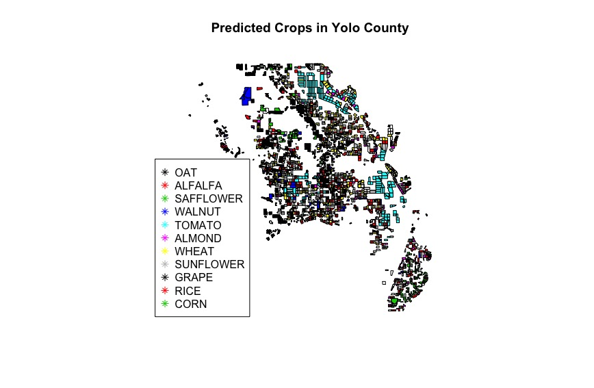

# GeoSpatial-Classification
## <a href = "http://www.rpbradystadavis.github.io">Crop Classification Report</a>

**How to Read this Github:** 
Crops_2016 Folder: This is the data from the Yolo County GIS

Data: These are various Datasets that we made from codes in Extracting Color Bands and also cleaned up versions.

Extracting Color Bands: These are codes that were ran using GDAL on the RUS copernicus server in order to crop fields and extract light bands.

Photos: These are pictures extracted from our data analysis

Un-used_codes: These are codes used in our initial exploration of data. Most of which were unused or not applicable. 

cb_2016_us_county_500k: These are counties in the united states, used for some plotting using the yolo county shapefile.

rplots: These are various plots in R of our data for data analysis and inclusion in our report.

Final_crop_classifier: This is our main jupyter notebook. This has the models and residual analysis specified in our report.

Hotelling_T_squared: This is the code we used to test whether organic and non-organic crops have the same light band distributions.
